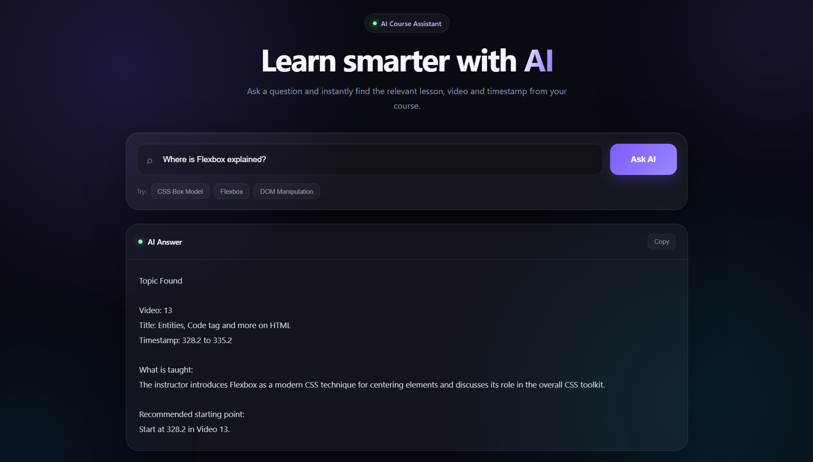

# RAG Based AI Teaching Assistant

An end-to-end **Retrieval Augmented Generation (RAG)** application that helps students quickly find where a topic is taught inside a course.

Instead of searching through hours of lecture videos manually, users can ask a question and the system retrieves the most relevant course content and provides the **video number, video title, timestamp, and a short explanation**.

---

---

## 🌐 Live Demo

**[Try the Live Demo](https://rag-base-ai.onrender.com/)**

---

## ✨ Features

* Ask questions about course content using natural language
* Retrieve the most relevant lecture sections
* Identify the relevant video number and title
* Provide the timestamp where the topic is discussed
* Generate a concise explanation using an LLM
* Semantic search using vector embeddings
* Responsive web interface
* Dark glassmorphism UI
* FastAPI backend
* Cohere embeddings
* Groq LLM inference
* Copy AI-generated answers

---

## 💡 Example

### User Question

```text
What is CSS Flexbox?
```

### AI Response

```text
Topic Found

Video: 12
Title: CSS Flexbox

Timestamp: 10:32 to 12:10

What is taught:
The lecture explains how Flexbox is used to arrange and align elements inside a container.

Recommended starting point:
Start at 10:32 in Video 12.
```

---

## 🧠 How It Works

The application follows a complete RAG pipeline:

```text
Course Videos
      ↓
Video → MP3
      ↓
Whisper Transcription
      ↓
Transcript JSON
      ↓
Merge Transcript Chunks
      ↓
Cohere Embeddings
      ↓
Embedding Storage
      ↓
User Question
      ↓
Question Embedding
      ↓
Cosine Similarity Search
      ↓
Top Relevant Chunks
      ↓
Groq LLM
      ↓
Answer with Video + Timestamp
```

---

# 🔍 RAG Pipeline

### 1. Collect Course Videos

Course lecture videos are placed inside the `videos` folder.

---

### 2. Convert Videos to Audio

The videos are converted into MP3 audio files using **FFmpeg**.

```text
videos/
   ↓
audios/
```

This makes the audio easier to process with the transcription model.

---

### 3. Transcribe Audio

The MP3 files are processed using **OpenAI Whisper**.

Whisper converts the spoken content into text while preserving timestamp information.

The application uses:

```text
Whisper large-v2
```

The transcription is stored as JSON containing information such as:

```json
{
    "number": "01",
    "title": "CSS Introduction",
    "start": 12.4,
    "end": 28.7,
    "text": "..."
}
```

---

### 4. Merge Transcript Chunks

Whisper produces relatively small transcript segments.

These segments are merged together to create larger and more meaningful chunks.

This provides better context during semantic search.

The current chunking approach uses overlapping transcript segments so that important information is not lost between chunks.

---

### 5. Create Embeddings

Each transcript chunk is converted into a vector embedding using the **Cohere Embed API**.

Current embedding model:

```text
embed-english-v3.0
```

Document chunks use:

```text
search_document
```

while user questions use:

```text
search_query
```

This allows the system to perform semantic similarity search between the user's question and course content.

---

### 6. Retrieve Relevant Content

When a user asks a question:

```text
What is CSS Flexbox?
```

the question is converted into an embedding.

The system then calculates **cosine similarity** between the question embedding and the stored course embeddings.

The most relevant chunks are selected.

Currently, the system retrieves the:

```text
Top 3 relevant chunks
```

---

### 7. Generate the Answer

The retrieved course content is passed to a Large Language Model through the **Groq API**.

Current model:

```text
openai/gpt-oss-20b
```

The LLM uses the retrieved course content to generate a concise response containing:

* Video number
* Video title
* Timestamp
* Explanation
* Recommended starting point

The model is instructed to answer only from the retrieved course content to reduce hallucinations.

---

# 🌐 Web Application

The project includes a web interface built using:

* HTML
* CSS
* JavaScript
* FastAPI
* Jinja2

The frontend provides:

* Dark glassmorphism UI
* Responsive design
* Question input
* Example questions
* Loading state
* AI response card
* Copy answer functionality
* Favicon and static assets

The frontend communicates with the FastAPI backend through the `/ask` API endpoint.

---

# ⚙️ Tech Stack

| Technology          | Purpose                   |
| ------------------- | ------------------------- |
| Python              | Core development          |
| FastAPI             | Backend API               |
| HTML/CSS/JavaScript | Frontend                  |
| Jinja2              | HTML template rendering   |
| OpenAI Whisper      | Speech-to-text            |
| Cohere              | Text embeddings           |
| Scikit-learn        | Cosine similarity         |
| Joblib              | Embedding storage         |
| Groq                | LLM inference             |
| FFmpeg              | Video-to-audio conversion |
| Render              | Deployment                |

---

# 📁 Project Structure

```text
Rag-base-Ai/
│
├── videos/
│   └── Course videos
│
├── audios/
│   └── Extracted MP3 files
│
├── jsons/
│   └── Whisper transcript JSON files
│
├── merge_jsons/
│   └── Merged transcript chunks
│
├── embed_merged_json/
│   └── embedding.joblib
│
├── templates/
│   └── index.html
│
├── static/
│   ├── style.css
│   ├── script.js
│   └── favicon.ico
│
├── video_to_mp3.py
├── mp3_to_json.py
├── merge_chunks.py
├── preprocess_json.py
├── main.py
├── schemas.py
├── requirements.txt
├── .env
└── README.md
```

---

# 🔑 Environment Variables

Create a `.env` file in the project root:

```env
COHERE_API_KEY=your_cohere_api_key
GROQ_API_KEY=your_groq_api_key
```

> **Important:** Never commit your `.env` file to GitHub.

Add it to `.gitignore`:

```text
.env
```

---

# 📦 Installation

Clone the repository:

```bash
git clone https://github.com/Kartikey-Gehra4994/Rag-base-Ai.git
```

Move into the project directory:

```bash
cd Rag-base-Ai
```

Install the Python dependencies:

```bash
pip install -r requirements.txt
```

Make sure **FFmpeg** is installed and available in your system PATH.

---

# 🚀 Running the Project

## Step 1 — Prepare Videos

Place the course videos inside:

```text
videos/
```

---

## Step 2 — Convert Videos to MP3

Run:

```bash
python video_to_mp3.py
```

The extracted audio files will be stored in:

```text
audios/
```

---

## Step 3 — Generate Transcripts

Run:

```bash
python mp3_to_json.py
```

Whisper will generate transcript JSON files inside:

```text
jsons/
```

---

## Step 4 — Merge Transcript Chunks

Run:

```bash
python merge_chunks.py
```

The processed chunks will be stored in:

```text
merge_jsons/
```

---

## Step 5 — Generate Embeddings

Run:

```bash
python preprocess_json.py
```

This creates:

```text
embed_merged_json/embedding.joblib
```

This file contains the vector representations used during retrieval.

---

## Step 6 — Start the FastAPI Application

Run:

```bash
uvicorn main:app --reload
```

Open the application:

**http://127.0.0.1:8000**

You can also access the FastAPI documentation:

**http://127.0.0.1:8000/docs**

---

# 🔌 API Endpoint

The application exposes a POST endpoint:

```text
POST /ask
```

### Request

```json
{
    "question": "What is CSS Flexbox?"
}
```

### Response

```json
{
    "answer": "Topic Found\n\nVideo: 12\nTitle: CSS Flexbox..."
}
```

---

# 🧩 Why RAG?

A general-purpose LLM may not know the specific content of a private course or a custom collection of videos.

RAG solves this problem by combining:

```text
Information Retrieval
        +
Large Language Model
```

Instead of asking the LLM to answer purely from its general knowledge, the system first retrieves relevant information from the course and then provides that information to the LLM.

This allows the application to generate answers based specifically on the course content.

---

# 🎯 Project Goals

The main goal of this project is to make long video courses easier to navigate.

Instead of manually searching through multiple lectures, a student can ask:

```text
Where is CSS Grid explained?
```

and receive:

```text
Video
  ↓
Title
  ↓
Timestamp
  ↓
Explanation
```

This reduces the time required to manually search through long course videos.

---

# 🔮 Future Improvements

Planned improvements include:

* Direct **Watch from Timestamp** buttons
* YouTube video integration
* More advanced vector database integration
* Improved semantic retrieval
* Re-ranking retrieved results
* Multi-language support
* Support for multiple courses
* Conversation history
* Streaming LLM responses
* More structured AI responses
* Improved citation and source display

---

# 👨‍💻 Author

**Kartikey Gehra**

Data Science / Machine Learning Enthusiast

**GitHub:**
https://github.com/Kartikey-Gehra4994
